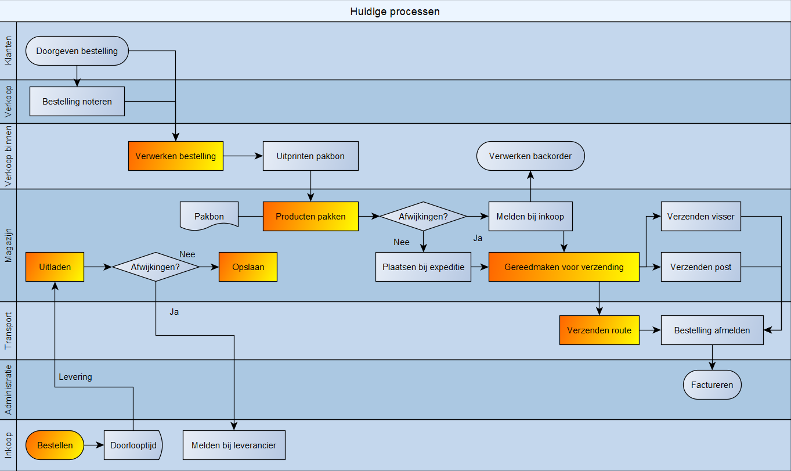

#Proces beschrijving
---

---
##**Inkoop**
###Bestellen
|Verantwoordelijkheid|Wie|  
|---:|---|
*Uitvoerend*| Inkoper  
*Eindverantwoordelijk*| Directeur  
*Ondersteunend*| Magazijnmedewerker  
*Geraadpleegd*|  
*Geïnformeerd*| Leverancier

**In het kort**  
Inkoop van producten voor verkoop.

**Werkvolgorde**
1. Loop door het magazijn heen met een notitieblok.  
1. Noteer alle artikelen waarvan er weinig tot geen meer van zijn.
1. Stel een lijst op per leverancier met hoeveelheid en artikel.
1. Stuur deze lijst op naar desbetreffende leverancier.  

**Uitzonderingen**

**Aandachtspunten**  
* Let op de bovenste schap van de stelling, vaak liggen hier nog onaangebroken voorraden.
* Vergeet niet om de backorders in de bestellijst mee te nemen.
* Als contactinformatie niet bekend is kan je deze gegevens uit het systeem ophalen.
---
### Verwerken backorder
|Verantwoordelijkheid|Wie|  
|---:|---|  
*Uitvoerend*| Inkoper   
*Eindverantwoordelijk*| Directeur  
*Ondersteunend*|    
*Geraadpleegd*| Orderpicker   
*Geïnformeerd*| Klant

**In het kort**  
Als een besteld product niet op voorraad ligt moet deze in backorder komen te staan.

**Werkvolgorde**  
1. Voer het pakbonnummer in het systeem in.  
1. Haal het artikel eruit dat niet geleverd kan worden.
1. Zet de bestelling on hold.
1. Informeer de klant over de nabestelling.

**Uitzonderingen**

**Aandachtspunten**  
* Bestel de producten die in backorder staan bij de eerstvolgende bestelling bij desbetreffende leverancier.
---
---

##**Verkoop**
### Verwerken bestelling
|Verantwoordelijkheid|Wie|  
|---:|---|  
*Uitvoerend*| Verkoper binnendienst   
*Eindverantwoordelijk*| Directeur   
*Ondersteunend*|  
*Geraadpleegd*| Klant of klant vertegenwoordiger   
*Geïnformeerd*|

**In het kort**  
Verwerk de bestelling in het systeem  

**Werkvolgorde**  
1. Zoek in het systeem naar de klant met zijn of haar bedrijfsnaam
1. Selecteer de klant en klik vervolgens op “Nieuwe bon”.
1. Selecteer hoe de bestelling is binnengekomen: *telefonisch, via WhatsApp, email order, email of balieverkoop.*
1. Zoek elk besteld product op met behulp van de zoekfunctie.
1. Klik op “+1” totdat de bestelde hoeveelheid is bereikt, doe dit voor elk product.
1. Wanneer alle producten op de bon staan kruis je “Verwerkt” aan en sla je deze op.

**Uitzonderingen**
* Als een product niet meer op voorraad wordt gehouden selecteer je het vervangende product of contacteer je de Klant
*	Als het overzicht van de klant vertegenwoordigers niet leesbaar is of onduidelijk contacteer je deze om voor opheldering te vragen.
*	Bij grote aantallen is het sneller om de hoeveelheid in te typen door links van het artikel te klikken.

**Aandachtspunten**  
* Let goed op spatsies wanneer je zoekt naar bedrijfsnamen en artikelen.
---
---
##**Magazijn**  
### Producten pakken
|Verantwoordelijkheid|Wie|  
|---:|---|
*Uitvoerend*| Orderpicker  
*Eindverantwoordelijk*| Operationeel manager
*Ondersteunend*| Magazijnmedewerker  
*Geraadpleegd*|  
*Geïnformeerd*| Klant

**In het kort**  
Een bestelling pakken voor een klant.

**Werkvolgorde**  
1. Pak een pakbon uit de brievenbakjes.
1. Pak een lastdrager die naast het expeditie vak staan
1. Loop naar de aangegeven locaties en pak de producten.
1. Zet de producten op de lastdrager en loop naar de volgende locatie.
1. Als alle producten zijn gepakt zet je alle producten van dezelfde pakbon bij elkaar in het expeditie vak.
1. Scan een pakbon als “Gepakt” en pak een nieuwe pakbon.

**Uitzonderingen**
* Als een product niet op voorraad is geef je dit aan op de pakbon en meld je dit bij de Inkoper.  

**Aandachtspunten**  
* Als de productlocatie onjuist of onbekend is kan je dit navragen bij de magazijnmedewerker.
* Als producten te hoog staan kan je de opstapjes gebruiken die aan het begin van de stellingen staan.

---

### Uitladen en opslaan
|Verantwoordelijkheid|Wie|  
|---:|---|  
*Uitvoerend*| Orderpicker en magazijnmedewerker
*Eindverantwoordelijk*| Operationeel manager
*Ondersteunend*|        
*Geraadpleegd*| Inkoper  
*Geïnformeerd*| Leverancier

**In het kort**  
Het controleren en opslaan van inkomende goederen.

**Werkvolgorde**  
1. Zet de pallets met geleverde goederen links in het magazijn.
1. Pak de pallet uit en zet de dozen die op de dichtstbijzijnde stelling moeten voor de stelling op de grond.
1. Doe dit totdat alle producten die op die stelling moeten staan op de grond ervoor staan.
1. Check of de hoeveelheid en het soort product overeenkomt met de bestelde producten a.d.h.v. de bestellijst.
1. Als dit klopt zet je de producten op de juiste locatie.
1. Verplaats de pallet naar de volgende locatie en doe hetzelfde.
1. Als de pallet leeg is leg je deze bij de andere pallets achter het expeditie vak.

**Uitzonderingen**
*	Als er geen plek meer is voor de producten zet je deze boven op de stelling waar het product zou moeten staan.
*	Als de levering niet overeenkomt met de bestellijst meld je dit bij de inkoper.
*	Bulk zet je niet in de schappen maar zet je in de palletstellingen.
*	Als de leverancier om een ruilpallet vraagt pak je er een van de palletstapel.

**Aandachtspunten**  

---

### Gereedmaken voor verzending
|Verantwoordelijkheid|Wie|  
|---:|---|   
*Uitvoerend*| Operationeel manager   
*Eindverantwoordelijk*| Directeur   
*Ondersteunend*|  
*Geraadpleegd*| Orderpicker  
*Geïnformeerd*| Bezorger

**In het kort**  
Controleren en inpakken van gepakte producten a.d.h.v. de pakbon

**Werkvolgorde**  
1.	Pak de stapel gepakte pakbonnen uit het brievenbakje.
1.	Loop naar het expeditie vak en zoek naar welke producten bij welke pakbon horen.
1.	Check of wat er staan overeenkomt met de pakbon
1.	Als het overeenkomt zet je alle producten van deze pakbon in een genummerde grijze bak.
1. Zet het nummer van de bak waar de artikelen inzitten op de pakbon.
1.	Als alle pakbonnen gecontroleerd zijn leg je deze terug in het brievenbakje.

**Uitzonderingen**
*	Als de gepakte artikelen niet overeenkomen met de pakbon zet je de producten in kwestie terug op hun locatie en pak je eventueel het juiste artikel erbij.
*	Als een order klein in omvang en hoeveelheid is pak je deze in in een doos.
* Als producten te groot zijn voor de kratten kan je deze los houden. Geef dit wel aan op de pakbon.

**Aandachtspunten**  

---
---

##**Verzenden**
### Route
|Verantwoordelijkheid|Wie|  
|---:|---|  
*Uitvoerend*| Bezorger          
*Eindverantwoordelijk*| Operationeel manager   
*Ondersteunend*| Magazijnmedewerker  
*Geraadpleegd*|  
*Geïnformeerd*| Klant

**In het kort**  
Bezorg bestellingen die met eigen vervoer meemoeten.

**Werkvolgorde**  
1. Rij het bestelbusje naar binnen en open de achterdeuren
1. Laad alle ingepakte artikelen in en check of alle te verzenden bestellingen aanwezig zijn.
1. Orden de pakbonnen op volgorde van de rijroute en scan deze op "Verzenden".
1. Rij de route en lever de bestellingen af aan de hand van het baknummer op de pakbon en de bak zelf.
1. Na terugkomst scan je alle geleverde pakbonnen als “Geleverd”

**Uitzonderingen**
* Als een klant niet aanwezig is neem je deze bestelling mee terug.  

**Aandachtspunten**

---

### Post
|Verantwoordelijkheid|Wie|  
|---:|---|   
*Uitvoerend*| Magazijnmedewerker   
*Eindverantwoordelijk*| Operationeel manager   
*Ondersteunend*| Verkoop binnendienst  
*Geraadpleegd*|  
*Geïnformeerd*| Klant

**In het kort**  
Klaarmaken en brengen naar het servicepunt van de postbezorger.

**Werkvolgorde**  
1. Zoek een geschikte doos waar alle producten van één bestelling in kunnen.  
1. Zet alle artikelen in de doos en vul grote leegtes op met opvulpapier.

**Uitzonderingen**

**Aandachtspunten**  

---

### Visser
|Verantwoordelijkheid|Wie|  
|---:|---|   
*Uitvoerend*| Magazijnmedewerker   
*Eindverantwoordelijk*| Operationeel manager   
*Ondersteunend*| Verkoop binnendienst  
*Geraadpleegd*|  
*Geïnformeerd*| Klant

**In het kort**  
Palletiseren van de bestelde producten.

**Werkvolgorde**  
1. Pak een pallet op Euromaat of halve Euromaat.  
1. Zorg ervoor dat alle artikelen van één pakbon netjes op de pallet komen te staan en niet uitsteken.
1. Zet de lading vast met stretchfolie totdat de gehele lading een aantal lagen folie heeft.

**Uitzonderingen**

**Aandachtspunten**  
* Gebruik dozen om kleinere producten te beschermen.
* Zet de zwaarste producten onderaan en zoveel mogelijk in het midden.
* Om op oneven producten toch te kunnen stapelen kan je een stukje karton gebruiken.

---
---

### Wat
|Verantwoordelijkheid|Wie|  
|---:|---|  
*Uitvoerend*|   
*Eindverantwoordelijk*|   
*Ondersteunend*|  
*Geraadpleegd*|  
*Geïnformeerd*|

**In het kort**  

**Werkvolgorde**  
1.  
1.  
1.  
1.  

**Uitzonderingen**

**Aandachtspunten**  
